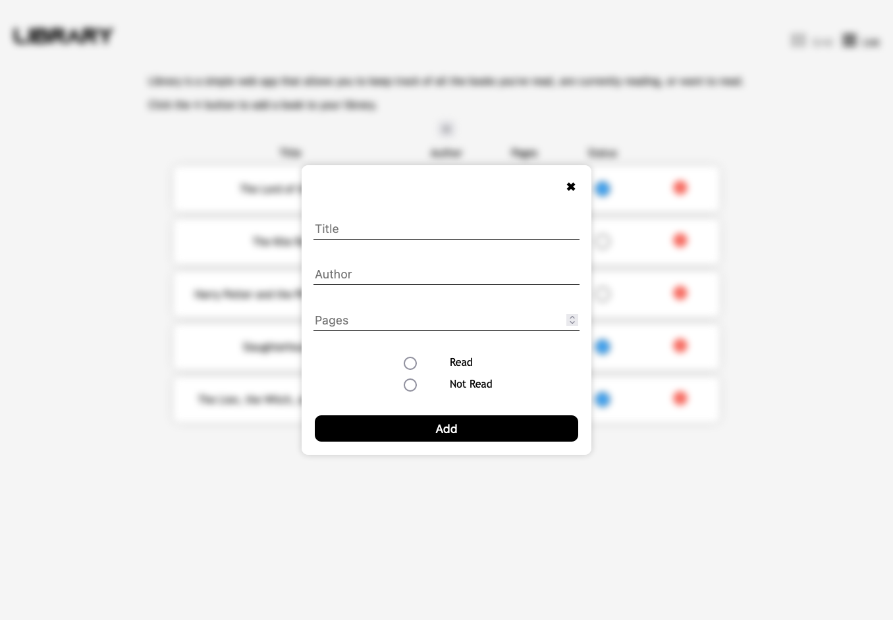

# Library

A work in progress.

## Live Demo

Check out the [live demo](https://mosmn.github.io/Library/).

## Screenshots

### Grid View

### List View

### Form

## Tech Stack

- JavaScript
- HTML
- CSS

## Approach

The approach for this project was to first create the basic structure of the web page using HTML and CSS. This included the layout of the page, the design elements, and the placement of various elements such as buttons and forms. Once the basic structure was in place, the focus shifted to adding functionality to the web page. This was the most challenging part of the project as it required a combination of DOM manipulation and object constructors to create a dynamic web page that could add and remove books from the library. To implement this functionality, I first created an empty array that would serve as the library. Next, I created a Book class that would be used to create new book objects with properties such as title, author, pages, and status. I then created a function that would display the books in the library by looping through the array and creating a new div element for each book. This element would then be appended to the book container on the web page. To add new books to the library, I created a form that would allow the user to input the book's information. When the user clicked the "Add" button, the information would be used to create a new Book object and added to the library array. The displayBooks function would then be called to update the web page with the new book. To remove books from the library, I added an event listener to the delete button that would remove the book card element from the web page and splice the corresponding book object from the library array. Overall, the project required a good understanding of DOM manipulation and object-oriented programming concepts, as well as the ability to think creatively to solve problems and implement new features.

## Challenges

One of the main challenges in this project was figuring out how to add and remove books from the library using DOM manipulation combined with object constructors. This required a good understanding of JavaScript and how to interact with the DOM. Additionally, implementing the toggle functionality for marking a book as read was also challenging, as it required understanding of event listeners and how to properly target specific elements. Another challenge was organizing and structuring the code in a readable and maintainable way. Overall, this project required a good understanding of JavaScript and web development concepts, as well as the ability to problem-solve and think critically.

## Future Features

- Add a search bar to search for books in the library
- Sort books by title, author, or pages
- Sort by read or unread books
